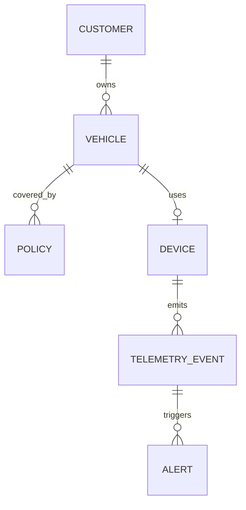

# Fleet Telemetry Sample Database

## Purpose

`FleetTelemetryLab` is a synthetic SQL Server workload designed for repeatable query-performance experiments.

The business scenario represents a multi-country vehicle services platform that manages customers, vehicles, tracking devices, insurance policies, telemetry events, and operational alerts.

All records are generated locally. The project contains no proprietary, personal, or production data.

## Data Model

## Schemas and Tables

| Schema | Table | Purpose |
|---|---|---|
| `crm` | `Customer` | Synthetic customer accounts and country distribution |
| `fleet` | `Vehicle` | Vehicles associated with customers |
| `fleet` | `Device` | Telematics devices currently assigned to vehicles |
| `insurance` | `Policy` | Insurance coverage periods and insured amounts |
| `telemetry` | `TelemetryEvent` | Time-series location and vehicle-state events |
| `telemetry` | `Alert` | Operational alerts generated from telemetry events |

## Verified Row Counts

| Table | Verified rows |
|---|---:|
| `crm.Customer` | 20,000 |
| `fleet.Vehicle` | 40,000 |
| `fleet.Device` | 40,000 |
| `insurance.Policy` | 60,000 |
| `telemetry.TelemetryEvent` | 1,000,000 |
| `telemetry.Alert` | 120,000 |

The dataset is large enough to produce meaningful differences in logical reads and execution plans while remaining practical on the resource-constrained lab workstation.

## Data Characteristics

The generators create deterministic and controlled distributions:

- Customers distributed across several Latin American country codes.
- Different numbers of vehicles per customer.
- Active, standby, and inactive devices.
- Current, expired, and cancelled policies.
- Exactly 25 events per device distributed across approximately 25 weeks.
- Open, closed, and escalated alerts.
- Repeated values suitable for cardinality-estimation experiments.

These distributions support realistic selectivity and parameter-sensitivity scenarios.

## Planned Performance Scenarios

The database will support experiments involving:

1. Date predicates and SARGability.
2. Missing and covering indexes.
3. Key lookups.
4. Composite-index column order.
5. Cardinality estimates and data skew.
6. Parameter-sensitive queries.
7. Aggregations, sorts, and memory grants.
8. Statistics and plan changes.
9. Actual execution plans.
10. Query Store comparisons.

## Reproducibility Rules

- Database creation and data generation must be script-driven.
- Scripts must be safe to rerun when documented prerequisites are followed.
- Generated values must not depend on external services.
- Target row counts must be validated after loading.
- Schema and data changes must be committed separately.
- Performance experiments must not modify the original baseline silently.

## Scope and Limitations

The model prioritizes performance-learning scenarios over complete business functionality. It does not represent a production-ready insurance or telematics platform.

Performance results are comparative measurements from the local lab and are not production-capacity claims.

## Build Order

Execute the scripts against the `SQL2025LAB` instance in the following order:

1. [`01-create-database.sql`](../sql/01-database/01-create-database.sql) creates and configures `FleetTelemetryLab`.
2. [`02-create-schema.sql`](../sql/01-database/02-create-schema.sql) creates the schemas, tables, constraints, and baseline indexes.
3. [`03-load-reference-data.sql`](../sql/01-database/03-load-reference-data.sql) loads customers, vehicles, devices, and policies.
4. [`04-load-telemetry-data.sql`](../sql/01-database/04-load-telemetry-data.sql) loads one million telemetry events and 120,000 alerts.
5. [`05-validate-sample-database.sql`](../sql/01-database/05-validate-sample-database.sql) performs the independent final validation.

The creation and loading scripts contain safety checks and refuse to overwrite an existing build. The validation script does not modify permanent data.

## Verified Build Results

| Measurement | Observed result |
|---|---:|
| Total rows across the six tables | 1,280,000 |
| Reference-data loading time | 4,785 ms |
| Telemetry and alert loading time | 15,954 ms |
| Validation checks passed | 45 of 45 |
| Validation execution time | 4,281 ms |
| Approximate reserved table space | 73 MB |

Execution times describe this specific local lab build. They are reproducibility evidence, not production-capacity benchmarks.

## Baseline Index State

The initial schema contains only the clustered primary keys and the unique indexes required by business-key constraints.

Supporting foreign-key indexes and query-specific performance indexes are intentionally omitted. This preserves an unoptimized baseline for measuring scans, lookups, logical reads, execution time, cardinality estimates, and plan changes during later experiments.
